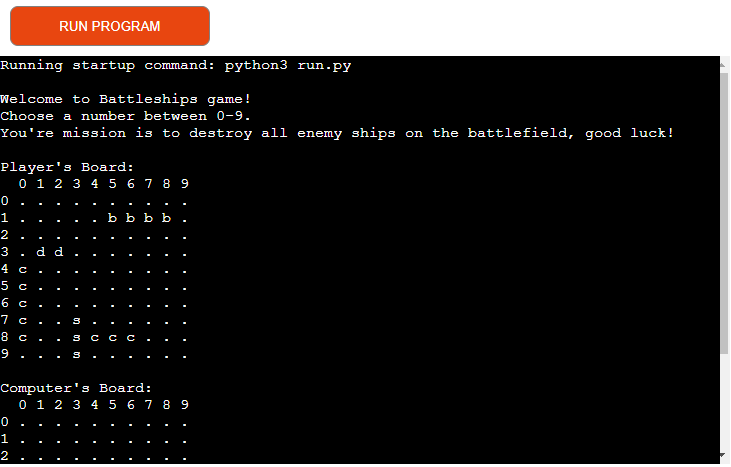

# Battleships Game

Welcome to the Battleships Game – a classic naval combat experience brought to life in Python! Engage in thrilling battles against the computer and strategically position your fleet to dominate the high seas.

Play the game here: <a href="https://python-battleships-game-4af4e24826a6.herokuapp.com/">Battleships Game</a>



## User Stories

**1. View Instructions:**

- Access clear instructions on how to play the game.

**2. Play the Game:**

- Understand the rules and objectives.
- Place my ships on the board strategically.
- Take turns guessing the opponent's ship locations.

**3. Receive Feedback:**

- See a visual representation of the game board after each turn.
- Receive clear feedback on hits and misses.
- Be notified when the game ends.

**4. Interact with the Interface:**

- Easily input my guesses during my turn.
- View the computer's guesses during its turn.
- See the current state of the game at any point.

**5. Enjoy a Colorful Interface:**

- See hits and misses highlighted in different colors.
- Experience a visually appealing game interface.

**6. Experience a Challenging AI:**

- Be challenged by a computer opponent with strategic moves.
- Witness the computer's attempts to sink my ships.

**7. Win or Lose the Game:**

- Be informed when I have successfully sunk all computer ships.
- Receive a notification when the computer sinks all of my ships.
- Understand the outcome of the game clearly.

**8. Restart the Game:**

- Easily restart the game to play again.

## Using Classes

The Battleships Game is structured using Python classes, offering a modular and organized approach to code design. The use of classes provides clear separation of concerns and enhances the maintainability and readability of the codebase.

### Player Class

The `Player` class encapsulates all aspects of a player, including their board, fleet, ship placement logic, and turn-taking functionality. This abstraction allows for easy extension and customization of player-related features.

Key functionalities of the `Player` class include:
- **Ship Placement:** Randomized placement of ships on the game board.
- **Turn-Taking:** Handling player turns, input validation, and targeting the opponent's board.
- **Feedback and Marking:** Providing real-time feedback on hits and misses, as well as marking the opponent's board.

### Computer Class

The `Computer` class, inheriting from the `Player` class, represents the computer opponent in the game. It leverages the same ship placement and turn-taking logic as the human player, offering a consistent and challenging gaming experience.

### Game Loop

The game itself is orchestrated by the `play_game` function, coordinating the turns between the human player and the computer opponent. The use of classes facilitates a clean separation of responsibilities and promotes code reusability.

Enjoy exploring the modular and object-oriented design of the Battleships Game, where classes enhance code organization and contribute to an enjoyable gaming experience!

## Code Features

### Input Validation and Error Handling

The Battleships Game incorporates robust input validation and error handling mechanisms to ensure a smooth and error-free gaming experience.

#### Player Input Validation

The `take_turn` method in the `Player` class validates user inputs during the targeting phase. Key features include:

- **Numeric Input:** Enforces that the entered values for row and column are numeric.
- **Range Check:** Verifies that the entered values fall within the valid range of 0 to 9 for both rows and columns.
- **Coordinate Uniqueness:** Prevents the player from targeting the same coordinates multiple times in a single game.

#### General Error Handling

The Battleships Game includes comprehensive error handling throughout the codebase. Examples include:

- **Invalid Input:** Catching ValueError for non-integer inputs during user interactions.
- **Index Errors:** Ensuring that index values do not go out of bounds when accessing elements in lists.
- **Logical Checks:** Verifying the logic of ship placement to avoid conflicts or errors.

## Game Features

### Dynamic Gameplay
- Experience the excitement of naval warfare with a dynamic turn-based gameplay.
- Challenge the computer AI in intense one-on-one battles.

### Fleet Deployment
- Strategically place your fleet of five iconic ships: Carrier (5 cells), Battleship (4 cells), Cruiser (3 cells), Submarine (3 cells), and Destroyer (2 cells).
- Randomized ship placement ensures a unique and challenging experience in each game.

### Tactical Decision-Making
- Take turns to target your opponent's fleet by entering coordinates on the game board.
- Make wise choices to sink your opponent's ships and avoid their relentless attacks.

### Real-Time Feedback
- Receive real-time feedback on hits and misses, accompanied by colorful emojis for a visually engaging experience.
- See the state of the battlefield with a clear display of your and your opponent's boards.

### Victory Conditions
- Win the game by strategically sinking all of your opponent's ships.
- A computer victory occurs when your fleet is entirely submerged beneath the waves.

### Colorful Interface
- Enjoy a visually appealing game interface with color-coded text using the `colorama` library.

Get ready for an immersive Battleships experience – command your fleet, outsmart your opponent, and claim victory on the high seas!

## Reminders

* Your code must be placed in the `run.py` file
* You must install the required dependencies with "pip install -r requirements.txt"
* Your dependencies must be placed in the `requirements.txt` file
* Do not edit any of the other files or your code may not deploy properly

## Testing
- I tested that this page works in different browsers: Chrome, Firefox, Safari.
- I confirmed that this project is responsive, looks good and functions on all standard screen sizes using the devtools device toolbar.
- I confirmed that you may choose where to target on the board and either a hit or miss occurs.
- I confirmed that all error handling works, cannot target same coordinates twice, strings and numbers over 9 are invalid inputs.

**Constraints**
- The deployment terminal is set to 80 columns by 24 rows. That means that each line of text needs to be 80 characters or less otherwise it will be wrapped onto a second line.

## Creating the Heroku app

When you create the app, you will need to add two buildpacks from the _Settings_ tab. The ordering is as follows:

1. `heroku/python`
2. `heroku/nodejs`

You must then create a _Config Var_ called `PORT`. Set this to `8000`

If you have credentials, such as in the Love Sandwiches project, you must create another _Config Var_ called `CREDS` and paste the JSON into the value field.

Connect your GitHub repository and deploy as normal.

## Local Deployment
Follow these steps to deploy the Battleships Game on your local machine.

**Clone the Repository**
- Open a terminal and run the following command to clone the project repository:

```console
git clone https://github.com/your-username/battleships-game.git
```

- Replace your-username with your GitHub username.

**Install Python to your local machine**
- Download and install Python on your computer from <a href="https://www.python.org/downloads/">Python website.</a>

**Navigate to the Project Directory**
- Change into the project directory by running the following command in your terminal:

```console
cd battleships-game
```

**Install the Required Dependencies**

```console
pip install -r requirements.txt
```

**Open the Game**
- Run the game by executing the `python run.py` script in your preferred Python environment.

**Enjoy the Game**
- You are now ready to enjoy the Battleships Game on your local machine! Feel free to explore the game interface, sink enemy ships, and test different strategies.

## Credits

Content
  - Some of the text for the README.md file were taken from <a href="https://chat.openai.com/">ChatGPT</a>

Styling
  - The styling for the game area was largely taken from the CI <a href="https://p3-battleships.herokuapp.com/">Battleships</a> project.
